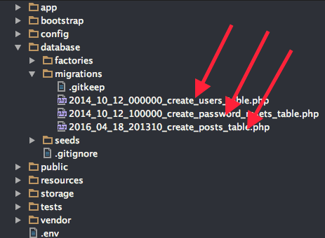

#মডেল
***
যদিও অধ্যায়টির নাম **মডেল(Model)** দিয়েছি, এটা আসলে **এলোকোয়েন্ট মডেল(Eloquent Model)** কিন্তু এটাকে শুধু এলোকোয়েন্ট না বলে **এলোকোয়েন্ট ওআরএম মডেল(Eloquent ORM Model)** বললে সঠিক ভাবে ইন্ডিকেট করা হয়। আর যখনই একবার এটাকে চিনে যাব তখন থেকে আমাদের লারাভেল বন্ধু মহলে শুধুই **মডেল(Model)** বলে ডাকবো।
অনেকটা "মাসনুন ভাই" বা "হাসিন ভাই" এর মতো, একবার চিনে গেলে আর পুরা নামটা বলা লাগে না।

আসুন ব্যাপার গুলোকে একটু ভেঙ্গে ভেঙ্গে বুঝে নেইঃ

#####ওআরএম(ORM)
পুরোটা হলো Object Relational Mapping, যা এক ধরনের কায়দা ব্যবহার করে অবজেক্টের মধ্যে রিলেশন তৈরি করে, এই অবজেক্ট গুলো মূলত ডাটাবেজ এর অবজেক্ট।

#####এলোকোয়েন্ট(Eloquent)
এলোকোয়েন্ট(Eloquent) হলো একটি ওআরএম(ORM) এর নাম, যা একটি একটিভ রেকর্ড(Active Record) এর প্রয়োগ(Implementations)। যেটা লারাভেল এর জন্যই তৈরি করা হয়েছে। এটা অন্যান্য ওআরএম থেকে বেশ শক্তিশালী ও বুদ্ধিমান। ডাটাবেজ নিয়ে কাজ করার সময় আমারা এর নানান কারিশমার সাথে পরিচিত হবো।

#####মডেল(Model)
মডেল হলো একধরনের ক্লাস যার প্রতিটি অবজেক্ট এক একটি টেবিলের এক একটি রো বা রেকর্ড কে রিপ্রেজেন্ট করে।
মনে করি আমাদের একটি টেবিল আছে যার নাম users. এবং যদি এর জন্য একটি মডেল বানাই তার নাম দিবো User. যা users টেবিল এর প্রতিটি রেকর্ড কে রিপ্রেজেন্ট করবে।
এখানে একটি মজার নিয়ম আমরা ফলো করবো, টেবিল এর নাম বহুবচন(plural) ও মডেল এর নাম একবচন(singular)। তখন আমরা যে মডেলটি বানাবো, এলোকোয়েন্ট ঠিকই তার টেবিলটি ডাটাবেজ থেকে খুঁজে ম্যাপ করে নিবে। যদি এই নিমের অন্যথা হয় তখন মডেল বানানোর সময় টেবিলটির নামটি বলে দিতে হবে।


আমরা এলোকোয়েন্ট ওআরএম ব্যবহার করে টেবিলে Create, Edit, Delete, Select এবং আরও অনেক কিছুই করতে পারবো কোনও SQL statement না লিখেই। আপনি কি রিলেশনাল ডাটাবেজ এর কথা ভাবছেন? হ্যাঁ, সেটাও আমরা এই সিস্টেম এর মধ্যেই করে ফেলবো!!

##করতে করতে শেখা
গত অধ্যায়ে আমরা একটি মাইগ্রেশন ও সেটাকে মাইগ্রেট করে একটি টেবিল বানিয়েছিলাম। আসুন আজ আবারও মাইগ্রেশন নিয়ে একটু অনুশীলন করে নেই।

##### প্রস্তুতিঃ
Terminal থেকে আমাদের প্রোজেক্ট ফোল্ডারে ঢুকে নিচের কমান্ডটি রান করাইঃ
```bash
php artisan migrate:reset
```
বলুনতো কি হলো? মনে না আসলে [মাইগ্রেশন](http://laravel.howtocode.com.bd/migration.html) অধ্যায়টি আরেকবার দেখে আসুন please.

``` /database/migrations ```
ডাইরেক্টরি খুলে সব মাইগ্রেশন ফাইলগুলি মুছে ফেলি।



আপনার প্রজেক্টে কমবেশি ফাইল থাকতেই পারে দরকার না হলে সেগুলোও মুছে ফেলতে পারেন।

এবার নতুন করে posts নামের টেবিলের জন্য একটি মাইগ্রেশন তৈরি করি লারাভেলের আরটিসান কমান্ড এর মাধ্যমে

```bash
php artisan make:migration 'create_posts_table' --create=posts
```
মাইগ্রেশনটি খুলুন ও লক্ষ্য করুন আপনার ক্লাসের নামটা লারাভেল কি সুন্দর ভাবে লিখেছে।
এবার প্রয়োজনীয় অংশ আপডেট করে নিচের মতো বানাইঃ
```php
<?php

use Illuminate\Database\Schema\Blueprint;
use Illuminate\Database\Migrations\Migration;

class CreatePostsTable extends Migration
{

    public function up()
    {
        Schema::create('posts', function (Blueprint $table) {
            $table->increments('id');
            $table->string('title', 255);
            $table->text('content');
            $table->tinyInteger('status')->default(1);
            $table->timestamps();
        });
    }

    public function down()
    {
        Schema::drop('posts');
    }
}
```
এবার মাইগ্রেট করি
```bash
php artisan migrate
```
তাহলে নিচের মতো একটি টেবিল পেলাম


##### মডেল তৈরিঃ

এখানে টেবিল এর নাম posts তাহলে মডেলের নাম হবে Post । আরটিসান কমান্ড এর মাধ্যমে কাজটি সেরে ফেলিঃ

```bash
php artisan make:model Post
```
মডেল গুলো সাধারণ ভাবে app ডিরেক্টরির রুটেই থাকে, মডেলটি খুললে আমরা এরকম পাবোঃ

```php
<?php

namespace App;

use Illuminate\Database\Eloquent\Model;

class Post extends Model
{
    //
}
```
এই Post ক্লাসটির মধ্যে আমরা নানা রকম property ও method এর মাধ্যমে মডেলটিকে define করবো।
