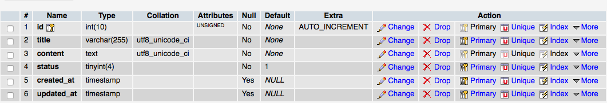
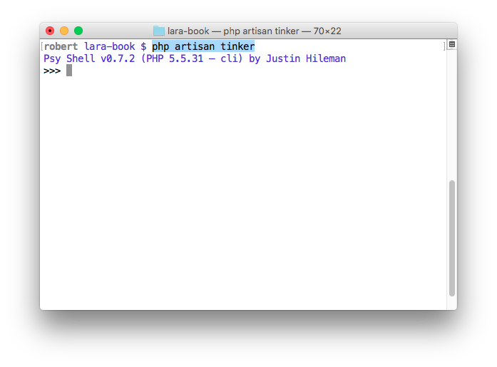
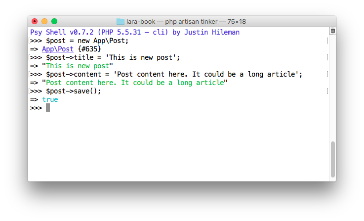

# মডেল

যদিও অধ্যায়টির নাম **মডেল\(Model\)** দিয়েছি, এটা আসলে **এলোকোয়েন্ট মডেল\(Eloquent Model\)** কিন্তু এটাকে শুধু এলোকোয়েন্ট না বলে **এলোকোয়েন্ট ওআরএম মডেল\(Eloquent ORM Model\)** বললে সঠিক ভাবে ইন্ডিকেট করা হয়। আর যখনই একবার এটাকে চিনে যাব তখন থেকে আমাদের লারাভেল বন্ধু মহলে শুধুই **মডেল\(Model\)** বলে ডাকবো। অনেকটা "মাসনুন ভাই" বা "হাসিন ভাই" এর মতো, একবার চিনে গেলে আর পুরা নামটা বলা লাগে না।

আসুন ব্যাপার গুলোকে একটু ভেঙ্গে ভেঙ্গে বুঝে নেইঃ

### ওআরএম\(ORM\)

পুরোটা হলো Object Relational Mapping, যা এক ধরনের কায়দা ব্যবহার করে অবজেক্টের মধ্যে রিলেশন তৈরি করে, এই অবজেক্ট গুলো মূলত ডাটাবেজ এর অবজেক্ট।

### এলোকোয়েন্ট\(Eloquent\)

এলোকোয়েন্ট\(Eloquent\) হলো একটি ওআরএম\(ORM\) এর নাম, যা একটি একটিভ রেকর্ড\(Active Record\) এর প্রয়োগ\(Implementations\)। যেটা লারাভেল এর জন্যই তৈরি করা হয়েছে। এটা অন্যান্য ওআরএম থেকে বেশ শক্তিশালী ও বুদ্ধিমান। ডাটাবেজ নিয়ে কাজ করার সময় আমারা এর নানান কারিশমার সাথে পরিচিত হবো।

### মডেল\(Model\)

মডেল হলো একধরনের ক্লাস যার প্রতিটি অবজেক্ট এক একটি টেবিলের এক একটি রো বা রেকর্ড কে রিপ্রেজেন্ট করে। মনে করি আমাদের একটি টেবিল আছে যার নাম users. এবং যদি এর জন্য একটি মডেল বানাই তার নাম দিবো User. যা users টেবিল এর প্রতিটি রেকর্ড কে রিপ্রেজেন্ট করবে। এখানে একটি মজার নিয়ম আমরা ফলো করবো, টেবিল এর নাম বহুবচন\(plural\) ও মডেল এর নাম একবচন\(singular\)। তখন আমরা যে মডেলটি বানাবো, এলোকোয়েন্ট ঠিকই তার টেবিলটি ডাটাবেজ থেকে খুঁজে ম্যাপ করে নিবে। যদি এই নিয়মের অন্যথা হয় তখন মডেল বানানোর সময় টেবিলটির নামটি বলে দিতে হবে।

আমরা এলোকোয়েন্ট ওআরএম ব্যবহার করে টেবিলে Create, Edit, Delete, Select এবং আরও অনেক কিছুই করতে পারবো কোনও SQL statement না লিখেই। আপনি কি রিলেশনাল ডাটাবেজ এর কথা ভাবছেন? হ্যাঁ, সেটাও আমরা এই সিস্টেম এর মধ্যেই করে ফেলবো!!

## করতে করতে শেখা

গত অধ্যায়ে আমরা একটি মাইগ্রেশন ও সেটাকে মাইগ্রেট করে একটি টেবিল বানিয়েছিলাম। আসুন আজ আবারও মাইগ্রেশন নিয়ে একটু অনুশীলন করে নেই।

#### প্রস্তুতিঃ

Terminal থেকে আমাদের প্রোজেক্ট ফোল্ডারে ঢুকে নিচের কমান্ডটি রান করাইঃ

```bash
php artisan migrate:reset
```

বলুনতো কি হলো? মনে না আসলে [মাইগ্রেশন](http://laravel.howtocode.com.bd/migration.html) অধ্যায়টি আরেকবার দেখে আসুন please.

`/database/migrations` ডাইরেক্টরি খুলে সব মাইগ্রেশন ফাইলগুলি মুছে ফেলি।


আপনার প্রজেক্টে কমবেশি ফাইল থাকতেই পারে দরকার না হলে সেগুলোও মুছে ফেলতে পারেন।

এবার নতুন করে posts নামের টেবিলের জন্য একটি মাইগ্রেশন তৈরি করি লারাভেলের আরটিসান কমান্ড এর মাধ্যমে

```bash
php artisan make:migration 'create_posts_table' --create=posts
```

মাইগ্রেশনটি খুলুন ও লক্ষ্য করুন আপনার ক্লাসের নামটা লারাভেল কি সুন্দর ভাবে লিখেছে। এবার প্রয়োজনীয় অংশ আপডেট করে নিচের মতো বানাইঃ

```php
<?php

use Illuminate\Database\Schema\Blueprint;
use Illuminate\Database\Migrations\Migration;

class CreatePostsTable extends Migration
{

    public function up()
    {
        Schema::create('posts', function (Blueprint $table) {
            $table->increments('id');
            $table->string('title', 255);
            $table->text('content');
            $table->tinyInteger('status')->default(0);
            $table->timestamps();
        });
    }

    public function down()
    {
        Schema::drop('posts');
    }
}
```

এবার মাইগ্রেট করি

```bash
php artisan migrate
```

তাহলে নিচের মতো একটি টেবিল পেলাম 

#### মডেল তৈরিঃ

এখানে টেবিল এর নাম posts তাহলে মডেলের নাম হবে Post । আরটিসান কমান্ড এর মাধ্যমে কাজটি সেরে ফেলিঃ

```bash
php artisan make:model Post
```

মডেল গুলো সাধারণ ভাবে app ডিরেক্টরির রুটেই থাকে, মডেলটি খুললে আমরা এরকম পাবোঃ

```php
<?php

namespace App;

use Illuminate\Database\Eloquent\Model;

class Post extends Model
{
    //
}
```

এই Post ক্লাসটির মধ্যে আমরা নানা রকম property ও method এর মাধ্যমে মডেলটিকে define করবো।

**কাস্টম টেবিল এর নাম**

এমন যদি হয় যে আপনার টেবিলটির নাম বহুবচন-একবচন নিয়মের বাইরে বা যেকোনো কারণেই আপনি আপনার মতো করে মডেলের নাম ও টেবিলের নাম ঠিক করলেন। তখন নিচের মতো করে করতে হবে।

```php
class Post extends Model
{
    protected $table = 'custom_posts_table';
}
```

তাহলে ইলোকয়েন্ট এই Post মডেলের সাথে custom\_posts\_table এর সংযোগ করে নিবে।

**টেবিল এর কাস্টম প্রাইমারি-কি\(primary key\)**

সাধারণ ভাবে ইলোকয়েন্ট একটি টেবিল এর প্রাইমারি-কি\(primary key\) id নামক কলামটাকেই ধরে নেয়, তাই মাইগ্রেশন তৈরি করার সময় primary key এর নাম অন্য রকম দিলে অবশই মডেলে নিচের মতো জানিয়ে দিতে হবে।

```php
class Post extends Model
{
    protected $primaryKey = 'post_id';
}
```

**টেবিল এ timestamps না চাইলে**

মাইগ্রেশিওন তৈরি করার সময় আমরা দেখেছি যে id ও timestamps\(created\_at ও updated\_at দুটি কলাম\) বানিয়ে দেয় এবং এগুলো মডেলেও আশা করে। তাই এটা না চাইলে, নিচের মতো করে জানাতে হবে।

```php
class Post extends Model
{
    public $timestamps = false;
}
```

**Mass-Assignment Vulnerability**

জিনিসটা কি জানার আগে আমরা একটা পরিস্থিতি কল্পনা করি। মনে করি, আমাদের একটি form আছে যেখান থেকে লেখকরা পোস্ট তৈরি করে সাবমিট করবে, এবং একটি মেথড এর সাহায্যে এক লাইনেই আমরা ডাটাবেজে সেভ করে নিব। পরে অ্যাডমিন পোস্টটি চেক করে, status 1 করে দিলেই পোস্টটি সাইট এ দেখাবে।

কিন্তু কোনও চালাক ডেভেলপার পোস্ট তৈরি করে সাবমিট করার সময় ইন্সপেক্ট এলিমেন্ট করে পোস্ট রিকুয়েস্ট এর সাথে status=1 পাঠিয়ে দিলো আর সেজন্য সাথে সাথেই পোস্টটি লাইভ হয়ে যাবে - তাতে যাচ্ছে তাই জাইই থাকুক না কেন। কি এটা একটা দুর্বলতা নয়?

আর এই দুর্বলতাকেই বলে ম্যাস অ্যাসাইনমেন্ট ভলনারাবিলিটি।

এই দুর্বলতা কাটাতে লারাভেল মডেলের জন্য দুটি প্রপার্টি দিয়েছেঃ fillable ও guarded । এদের যে কোনও একটিকে আমাদের মডেলে ব্যবহার করলেই এই দুর্বলতা কাটাতে পারবো, নিচের কোড টি দেখুন, আমাদের posts টেবিলের জন্য লেখা।

```php
class Post extends Model
{
    protected $guarded = ['status'];
    protected $fillable = ['title', 'content'];
}
```

এখন কেউ ওই চালাকি করলেই লারাভেল "ম্যাস অ্যাসাইনমেন্ট এক্সসেপসন" নামক এরর দিবে।

## Tinker নিয়ে কিছু মজা!

টিঙ্কার হলো লারাভেল এর একটি CLI, যেটা দিয়ে আমরা আমাদের এপ্লিকেশন এর সাথে ইন্টারাক্ট করতে পারবো। আসুন tinker দিয়ে আমাদের তৈরি মডেলটাকে একটু টেস্ট করার সাথে সাথে কিছু জিনিস শিখে নেই। আমাদের Terminal এ নিচের আরটিসান কমান্ডটি দেই

```bash
php artisan tinker
```

 দেখতে এরকমই। আপনাদের সুবিধার্থে বেশ কিছু স্ক্রিনশুঁঠ দিবো। এবার ওখানে `exit` লিখুন, দেখবেন আপনাকে goodbye জানিয়েছে। আবার tinker শেল এ ফিরে আসুন কারণ আমরা এখন আমাদের মডেল নিয়ে এখানে কিছু শিখব।

এবার আমাদের App নেম স্পেস এর Post মডেলের একটি অবজেক্ট তৈরি করি এভাবেঃ

```bash
$post = new App\Post;
```

তারপর নিচের মতো title ও content এর ভেলু দিয়ে অবজেক্ট টির save method কে কল করি।

```php
$post->title = 'This is new post';
$post->content = 'Post content here. It could be a long article';
$post->save();
```

tinker এ এমন দেখাবে  করেছেন? এবার ডাটাবেজটা একটু খুলে দেখুন।  আসুন এবার একটি array পাস করে একবারেই আরেকটি পোস্ট বানাই।

```bash
$post = App\Post::create(['title'=>'2nd awesome post', 'content'=>'Mind blowing content']);
```

এখন যদি আপনি ম্যাস অ্যাসাইনমেন্ট ভলনারাবিলিট ঠিক করার জন্য আপনার মডেল ঠিক না করেন তবে নিশ্চয় এরর পাবেন।

এবার সব পোস্ট গুলো দেখার জন্য নিচের কমান্ডটি দিন।

```bash
App\Post::all()->toArray();
```

এবার id দিয়ে একটি পোস্ট খুঁজে বের করি

```bash
$post = App\Post::find(2);
```

উপরের কমান্ড গুলো Terminal এ এমন 

টিঙ্কার নিয়ে বেশ মাজা হলো এরপর আমারা আমাদের আগের অধ্যায়ের জ্ঞান ব্যবহার করে ফর্ম থেকেই পোস্ট তৈরি করবো।

**পরবর্তী অধ্যায় "মধ্যবর্তী প্রোজেক্ট - ১" এ আমরা মডেল এর ব্যবহার দেখবো।**

