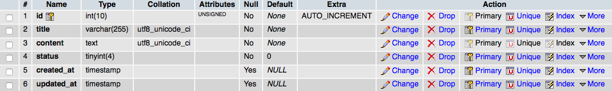
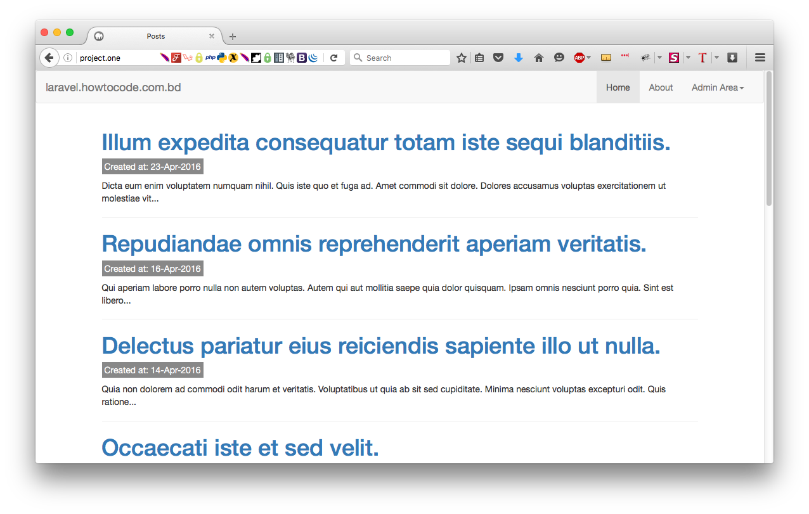

# সিড(Seed) ও ইনডেক্স পেইজ  
***
##প্রস্তুতি
যেহেতু এই প্রোজেক্টটি একটি blog এর মতো হবে তাই হোম বা ইনডেক্স পেইজ এ আমাদের পোস্ট গুলোর লিস্ট থাকাই স্বাভাবিক।

### posts টেবিল এর জন্য Post মডেল তৈরিঃ
[মডেল](http://laravel.howtocode.com.bd/model.html) অধ্যায়ে আমার এই বিষয় নিয়ে বেশ আলোচনা করেছিলাম, চাইলে একবার ঘুরে আসতে পারেন।

আসুন নিচের কমান্ডটি দেইঃ
```bash
php artisan make:model Post
```
```project.one/app/Post.php``` ফাইলটি আমরা পাবো, সাধারণ নিয়ম অনুসারে Post ক্লাসটি, গত অধ্যায়ে migrate করা posts টেবিলটাকেই গ্রহণ করবে।
আসুন টেবিলটি দেখে নেইঃ


এবার Post.php ফাইলটি খুলি
```php
<?php

namespace App;

use Illuminate\Database\Eloquent\Model;

class Post extends Model
{
    //
}

```
এবং নিচের মতো পরিবর্তন করি
```php
class Post extends Model
{
    protected $guarded = ['status'];
    protected $fillable = ['title', 'content'];
}
```
অংশটি বোঝার জন্য [এইখানে দেখুন](http://laravel.howtocode.com.bd/model.html#massassignment-vulnerability) ।

### posts টেবিল এ কিছু রেকর্ড ইন্সার্ট করি ডেভেলপমেন্ট এর সুবিধার জন্য
আমরা আগেই [Tinker](http://laravel.howtocode.com.bd/model.html#tinker-%E0%A6%A8%E0%A6%BF%E0%A7%9F%E0%A7%87-%E0%A6%95%E0%A6%BF%E0%A6%9B%E0%A7%81-%E0%A6%AE%E0%A6%9C%E0%A6%BE) ব্যবহার করে কিভাবে টেবিলে ডাটা ইন্সার্ট করা যায় তা দেখেছিলাম। আজ দেখবো Seeding ।

## সিডিং(Seeding)
লারাভেল ডাটাবেজে টেস্ট ডাটা ইন্সার্ট করার জন্য সাধারণ একটি method যোগ করেছে, যার নাম সিডিং(Seeding)। সব সিড ক্লাস ```database/seeds ``` ডাইরেক্টরিতে থাকে। সিড ক্লাস এর নাম আপনি যেকোনো কিছুই দিতে পারেন, কিন্তু কিছু রীতি মেনে নাম দেয়াই ভালো, যেমন আমাদের posts টেবিলের সিডার ক্লাস এর নাম হতে পারে ``` PostsTableSeeder ```।

আসুন তাহলে আমাদের সিডার বানিয়ে ফেলি নিচের কমান্ড দিয়েঃ
```bash
php artisan make:seeder PostsTableSeeder
```
আমরা নিশ্চয় ```project.one/database/seeds/PostsTableSeeder.php``` ফাইলটি পাবো।
```php
<?php

use Illuminate\Database\Seeder;

class PostsTableSeeder extends Seeder
{
    /**
     * Run the database seeds.
     *
     * @return void
     */
    public function run()
    {
        //
    }
}
```
আমাদের ফাইলটাকে পরিবর্তন করার আগে আসুন ```project.one/database/seeds/DatabaseSeeder.php``` ফাইল এ একটু পরিবর্তন আনি নিচের মতো।

```php
<?php

use Illuminate\Database\Seeder;

class DatabaseSeeder extends Seeder
{
    /**
     * Run the database seeds.
     *
     * @return void
     */
    public function run()
    {
        $this->call(PostsTableSeeder::class);
    }
}
```
এবার ```project.one/database/seeds/PostsTableSeeder.php``` ফাইলটাকে পরিবর্তন করি

```php
public function run()
    {
        DB::table('posts')->insert([
            'title' => 'Seeding Title',
            'content' => 'Seeding content'
        ]);
    }
```
এবার নিচের কমান্ডটি দিন ও ডাটাবেজে টেবিলটির পরিবর্তন লক্ষ্য করুন।
```bash
php artisan db:seed
```
<div class='caution-div'>
<span class='caution'>সতর্কতাঃ</span> আপনি যদি নিচের মতো এরর দেখেন
<pre>
<code class="lang-bash">[ReflectionException]                  
Class PostsTableSeeder does not exist</code>
</pre>

তাহলে নিচের কমান্ডটি দিন।
<pre>
<code class="lang-bash">composer dump-autoload
</code></pre>
আবার db::seed কমান্ডটি দিন ও ডাটাবেজে টেবিলটির পরিবর্তন লক্ষ্য করুন।
</div>

**কিন্তু Tinker বা উপরের মতো করে টেস্ট ডাটা ডাটাবেজে ঢুকানো বড়ই কষ্টকর তাই লারাভেল টেস্ট ডাটার কারখানা বানিয়ে দিয়েছে, আসুন তার সাথে পরিচিত হই।**

### মডেল ফ্যাক্টরি(model factory) এর ব্যবহারঃ
```project.one/database/factories/ModelFactory.php``` ফাইলটিতে নিচের মতো করে একটি ফ্যাক্টরি ডিফাইন করি।
```php
$factory->define(App\Post::class, function (Faker\Generator $faker) {
    return [
        'title' => $faker->sentence(mt_rand(3, 10)),
        'content' => join("\n\n", $faker->paragraphs(mt_rand(3, 6))),
        'created_at' => $faker->dateTimeBetween('-1 month', '+3 days'),
    ];
});
```

```project.one/database/seeds/DatabaseSeeder.php``` ফাইলটি আগের মতোই থাকুক।
```php
<?php

use Illuminate\Database\Seeder;

class DatabaseSeeder extends Seeder
{
    /**
     * Run the database seeds.
     *
     * @return void
     */
    public function run()
    {
        $this->call(PostsTableSeeder::class);
    }
}
```
এবার ```project.one/database/seeds/PostsTableSeeder.php``` ফাইলটাকে পরিবর্তন করি
```php
<?php

use Illuminate\Database\Seeder;

class PostsTableSeeder extends Seeder
{
    /**
     * Run the database seeds.
     *
     * @return void
     */
    public function run()
    {
        App\Post::truncate(); // delete all previous rows

        factory(App\Post::class, 10)->create(); // Create 10 rows
    }

}
```
এবার নিচের কমান্ডটি দিন ও ডাটাবেজে টেবিলটির পরিবর্তন লক্ষ্য করুন।
```bash
php artisan db:seed
```
**আপনি এভাবে মডেল ফ্যাক্টরি ও ফেকার এর সাহায্যে সহজেই ইউজার, পাসওয়ার্ড, ঠিকানা, মানুষের নাম এবং আরও অনেক কিছুই তৈরি করতে পারেন।**

## ইনডেক্স পেইজ তৈরি
আমরা [ব্লেড টেমপ্লেটিং](http://laravel.howtocode.com.bd/blade-template.html) অধ্যায়ে দেখেছি কিভাবে ভিউ ও টেমপ্লেটিং করতে হয়। তাই সময় নষ্ট না করে নিচের মতো করে project.one/resources/views এর মধ্যে master.blade.php ফাইলটি তৈরি করি।

```html
<!doctype html>
<html lang="en">
<head>
    <meta charset="UTF-8">
    <title>@yield('title')</title>
    <link rel="stylesheet" href="https://maxcdn.bootstrapcdn.com/bootstrap/3.3.6/css/bootstrap.min.css">
    {!! Html::style('css/style.css') !!}
</head>
<body>
@include('partials.navbar')
<div class="container">

    <div class="row">
        @yield('content')
    </div>
</div>

<script src="{!! asset('js/jquery-1.12.2.min.js') !!}"></script>
<script src="https://maxcdn.bootstrapcdn.com/bootstrap/3.3.6/js/bootstrap.min.js"></script>
</body>
</html>
```
৬ নম্বর লাইনে CDN থেকে টুইটার বুটস্ত্রাপ লিঙ্ক করা হয়েছে।
আসুন নিজেদের স্টাইল এর জন্য project.one/public/css পাথে style.css নামে একটি ফাইল তৈরি করি, যেটা ৭ নম্বর লাইনে লিঙ্ক করা হয়েছে। কিছু CSS যোগ করি এই ফাইলেঃ

```css
.post-info span {
    background-color: #888;
    color: #fff;
    padding: 4px;
}
```
এবার project.one/public ফোল্ডারে js নামে আরেকটি ফোল্ডার করে jquery-1.12.2.min.js ডাউনলোড করে রাখি, যেটা ১৬ নং লাইনে লিঙ্ক করা হয়েছে। তার পরের লাইন টি আশা করি বুজতে পারছেন।

১০ নং লাইনে দেখুন navbar.blade.php নামে একটি ফাইল ইনক্লুড করা হয়েছে আসুন project.one/resources/views এর মধ্যে partials নামে একটি ফোল্ডার বানিয়ে ফাইলটি নিচের মতো বানিয়ে ফেলি।

```html
<nav class="navbar navbar-default">
    <div class="container-fluid">
        <!-- Brand and toggle get grouped for better mobile display -->
        <div class="navbar-header">
            <button type="button" class="navbar-toggle collapsed" data-toggle="collapse" data-target="#bs-example-navbar-collapse-1">
                <span class="sr-only">Toggle navigation</span>
                <span class="icon-bar"></span>
                <span class="icon-bar"></span>
                <span class="icon-bar"></span>
            </button>
            <a class="navbar-brand" href="/">laravel.howtocode.com.bd @yield('action')</a>
        </div>

        <!-- Navbar Right -->
        <div class="collapse navbar-collapse" id="bs-example-navbar-collapse-1">
            <ul class="nav navbar-nav navbar-right">
                <li class="active"><a href="/">Home</a></li>
                <li><a href="/about">About</a></li>
                <li class="dropdown">
                    <a href="#" class="dropdown-toggle" data-toggle="dropdown" role="button" aria-expanded="false">Admin Area<span class="caret"></span></a>
                    <ul class="dropdown-menu" role="menu">
                        <li><a href="/admin/posts/new">New Post</a></li>
                        <li><a href="/admin/posts">Edit</a> </li>
                    </ul>
                </li>
            </ul>
        </div>
    </div>
</nav>
```
এটা টুইটার বুটস্ত্রাপের সাধারন navbar, যেখানে লিঙ্ক গুলা তৈরি করেছি, পরে পেইজ গুলাও বানাবো।

এবার আসুন routes.php ফাইলে আমাদের হোমে রুট বানাই। নিচের মতো করে(**এটা লারাভেল 5.2.31 ভার্সন**)

```php
<?php

/*
|--------------------------------------------------------------------------
| Application Routes
|--------------------------------------------------------------------------
|
| Here is where you can register all of the routes for an application.
| It's a breeze. Simply tell Laravel the URIs it should respond to
| and give it the controller to call when that URI is requested.
|
*/

Route::get('/', 'PostsController@index');
```
এবার নিচের কমান্ড দিয়ে PostsController টি বানিয়ে ফেলি।
 ```bash
php artisan make:controller PostsController
 ```
ও নিচের মতো পরিবর্তন করি।

```php
<?php

namespace App\Http\Controllers;

use Illuminate\Http\Request;

use App\Http\Requests;
use App\Post;

class PostsController extends Controller
{
    public function index(){
        $posts = Post::all();
        return view('posts.index', compact('posts'));
    }
}
```
এবার ভিউ তৈরি project.one/resources/views এর ভিতর posts নামে ফোল্ডার করে index.blade.php নামে নিচের মতো একটি ফাইল বানাই।
```html
@extends('master')
@section('title', 'Posts')
@section('content')
    <div class="col-md-12">
        @if (count($posts))
            @foreach($posts as $post)
                <article>
                    <a href="#"><h1>{!! $post->title !!}</h1></a>
                    <div>
                        <p class="post-info"><span>Created at: {{$post->created_at->format('d-M-Y')}}</span></p>
                    </div>
                    <div class="post-excerpt">
                        {!! str_limit($post->content, 150) !!}
                    </div>
                </article>
                <hr>
            @endforeach
        @else
            <h1>Hi, you've landed in our First Prject!</h1>
            <h2>Sorry, We don't have any post right now.</h2>
        @endif
    </div>
@endsection
```

এবার আমরা ব্রাউজারে আমাদের প্রোজেক্ট টি চেক করি, আশা করি নিচের মত দেখতে হবে, না হোলে কমেন্টে জানান দয়া করে।


## কি ভাবে সোর্স কোড পাওয়া যাবে?

গিটহাব এর [project.one](https://github.com/robertbiswas/project.one) রিপজিটোরিটি ফোর্ক করুন এবং আপনার সিস্টেমে ক্লোন করুন।

এই অধ্যায়ের সোর্স কোড পেতে
```bash
git checkout f384e15
```

সর্বশেষ কমিট পর্যন্ত পেতে আবার নিচের কমান্ডটি দিন
```bash
git checkout master
```
